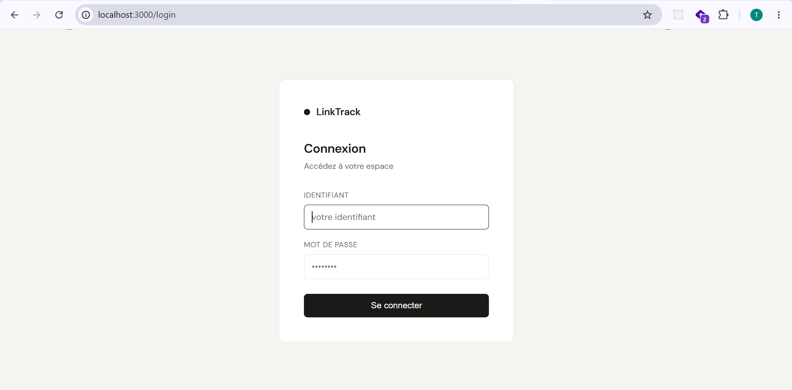

# LinkTrack

A self-hosted link tracking platform built with Express.js. Generate short tracking links, monitor clicks in real time, and analyze your audience — all from a clean dashboard.

## Screenshots



## Features

- **Link tracking** — generate unique tracking URLs and redirect visitors to any destination
- **Real-time dashboard** — total clicks, active links, countries reached, mobile vs desktop ratio
- **Click journal** — full history with IP, country, city, browser, OS, and device for every click
- **Link detail page** — per-link analytics with click breakdown
- **Multi-user** — each user manages their own links and data independently
- **Role-based access** — `user` role for the dashboard, `admin` role for user management
- **Admin panel** — create/delete users, reset any user's password, reset the database
- **Password management** — users can change their own password from the sidebar
- **Geolocation** — country and city detection via `geoip-lite` (local network detected as `Local/Localhost`)
- **Device detection** — browser, OS, and device type parsed from the User-Agent

## Tech Stack

| Layer | Technology |
|---|---|
| Runtime | Node.js |
| Framework | Express.js 5 |
| Database | [Turso](https://turso.tech) (libSQL / SQLite edge) |
| ORM | Drizzle ORM |
| Auth | express-session + bcryptjs |
| Geolocation | geoip-lite |
| UA Parsing | ua-parser-js |

## Project Structure

```
link-tracker/
├── index.js                  # Entry point — DB init then server start
├── src/
│   ├── app.js                # Express setup, middleware, route mounting
│   ├── db/
│   │   ├── index.js          # Turso client + Drizzle instance + schema init
│   │   └── schema.js         # Drizzle table definitions
│   ├── controllers/
│   │   ├── authController.js
│   │   ├── adminController.js
│   │   ├── linksController.js
│   │   ├── statsController.js
│   │   └── trackingController.js
│   ├── routes/
│   │   ├── auth.js
│   │   ├── admin.js
│   │   ├── links.js
│   │   ├── stats.js
│   │   └── tracking.js
│   └── middleware/
│       └── auth.js           # requireAuth, requireAdmin, requireUser
└── public/
    ├── index.html            # Dashboard shell (sidebar + modals)
    ├── admin.html            # Admin panel
    ├── login.html            # Login page
    ├── pages/                # HTML page fragments loaded dynamically
    │   ├── dashboard.html
    │   ├── links.html
    │   ├── clics.html
    │   └── detail.html
    ├── css/
    │   └── style.css
    └── js/
        ├── dashboard.js
        └── admin.js
```

## Getting Started

### Prerequisites

- Node.js 18+
- A [Turso](https://turso.tech) account (free tier available)

### 1. Clone the repository

```bash
git clone https://github.com/your-username/link-tracker.git
cd link-tracker
npm install
```

### 2. Create a Turso database

```bash
# Install the Turso CLI
curl -sSfL https://get.tur.so/install.sh | bash

# Log in
turso auth login

# Create a database
turso db create link-tracker

# Get the database URL
turso db show link-tracker --url

# Create an auth token
turso db tokens create link-tracker
```

### 3. Configure environment variables

Create a `.env` file at the root of the project:

```env
PORT=3000
SESSION_SECRET=your-long-random-secret-here

TURSO_DATABASE_URL=libsql://your-db.turso.io
TURSO_AUTH_TOKEN=your-auth-token
```

> Generate a strong session secret with: `node -e "console.log(require('crypto').randomBytes(64).toString('hex'))"`

### 4. Start the server

```bash
# Development (auto-reload)
npm run dev

# Production
npm start
```

The server will connect to Turso, create the tables, and seed the `admin` account on first run.

### 5. Log in

Open `https://link-tracker-wine-five.vercel.app/login` and sign in with:

- **Username:** `test.test`
- **Password:** `test123`

> Change the admin password immediately from the sidebar after your first login.

## User Roles

| Role | Access |
|---|---|
| `admin` | Admin panel only — manage users, reset DB. Cannot create links. |
| `user` | Dashboard — create links, view stats and click history. |

The admin account is created automatically on first startup. Additional users are created by the admin from the `/admin` panel.

## API Endpoints

| Method | Route | Auth | Description |
|---|---|---|---|
| `GET` | `/track/:id` | Public | Redirect and record a click |
| `GET` | `/login` | Public | Login page |
| `POST` | `/login` | Public | Authenticate |
| `POST` | `/logout` | Any | Destroy session |
| `GET` | `/api/me` | Any | Current user info |
| `POST` | `/api/me/password` | Any | Change own password |
| `GET` | `/api/stats` | User | Dashboard stats |
| `POST` | `/api/links` | User | Create a tracking link |
| `GET` | `/api/links/:id/clicks` | User | Link detail + click history |
| `GET` | `/admin/api/users` | Admin | List all users |
| `POST` | `/admin/api/users` | Admin | Create a user |
| `DELETE` | `/admin/api/users/:id` | Admin | Delete a user |
| `PUT` | `/admin/api/users/:id/password` | Admin | Reset a user's password |
| `POST` | `/admin/api/reset` | Admin | Reset the entire database |

## Deployment

The app is a standard Node.js HTTP server — deploy it anywhere that supports persistent Node.js processes:

- **Railway** — connect your GitHub repo, set env variables, deploy
- **Render** — free tier available, same process
- **Fly.io** — Dockerfile optional, works with `npm start`
- **VPS** — run with `pm2 start index.js`

Set the environment variables (`PORT`, `SESSION_SECRET`, `TURSO_DATABASE_URL`, `TURSO_AUTH_TOKEN`) in your platform's dashboard. Turso is a remote database so no extra setup is needed on the server.

## License

ISC
